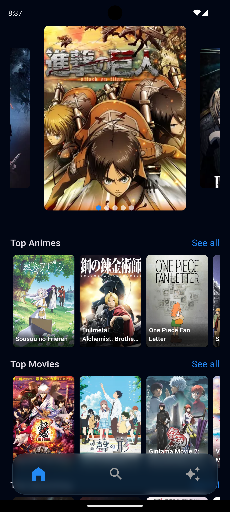
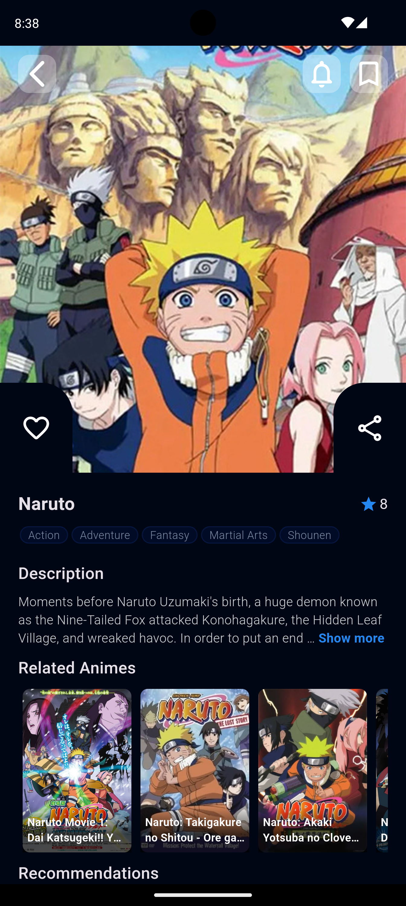
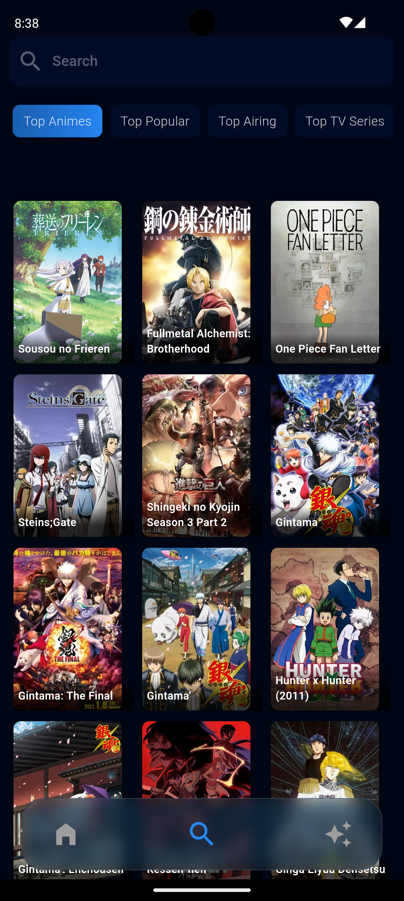

# Anime App


An intuitive app to browse and search for your favorite anime using the MyAnimeList API.


---

## Design Inspiration 🎨

Design Inspiration: [View Design Inspiration](https://dribbble.com/shots/19415785-Anime-Streaming-App?utm_source=Clipboard_Shot&utm_campaign=tinaabolghasem&utm_content=Anime%20Streaming%20App&utm_medium=Social_Share&utm_source=Clipboard_Shot&utm_campaign=tinaabolghasem&utm_content=Anime%20Streaming%20App&utm_medium=Social_Share)

---


## Screenshots

 Home Screen             | Anime Detail            
:------------------------:|:------------------------:
  |  

 Browse Animes             | Seasonal Animes              
:------------------------:|:------------------------:
  |  
                      


---

## Installation

Follow these steps to set up the app:

1. **Clone the repository**
    ```bash
    git clone https://github.com/Dilman01/anime_app.git

    cd anime_app
    ```
2. **Set up MyAnimeList API Key**
   * Visit [MyAnimeList Website](https://myanimelist.net/) to Sign up or log in to your account
   * Go to Account Settings > API.
   * Create your App id.
  

3. **Add the API Key to the project**
   * Create app_config file in the following directory:
    ```bash
    lib/
    └── core/
        └── config/
            └── app_config.dart  
    ```
    * In the app_config.dart file add the API key in the clientId variable:
    ```dart
    const clientId = 'your_api_key_here';
    ```
   
4. **Install dependencies**
   ```bash
    flutter pub get
   ```
5. **Run the app**
   ```bash
    flutter run
   ```
---

## Contact
For questions or feedback, please contact dilmandev@gmail.com.